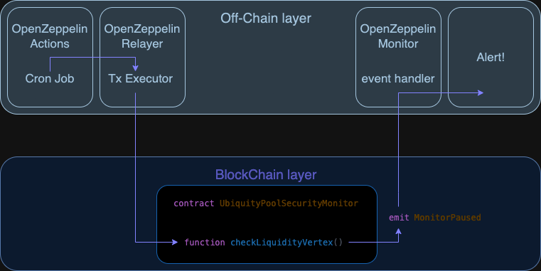

# UbiquityPoolSecurityMonitor Off-Chain part

A crucial component of the `UbiquityPoolSecurityMonitor` contract workflow is its off-chain integration. The `checkLiquidityVertex()` function must be periodically triggered by OpenZeppelin Defender to ensure continuous liquidity monitoring and security assessments.

The workflow consists of four key components:

1. **[OpenZeppelin Actions](https://docs.openzeppelin.com/defender/module/actions)**: Executes a cron job that triggers the Relayer to call the `checkLiquidityVertex()` function.
2. **[OpenZeppelin Relayer](https://docs.openzeppelin.com/defender/module/relayers)**: Performs the transaction that invokes the `checkLiquidityVertex()` function.
3. **UbiquityPoolSecurityMonitor Contract**: Conducts the on-chain liquidity check, takes necessary actions if an incident occurs, and emits the `MonitorPaused` event.
4. **[OpenZeppelin Monitor](https://docs.openzeppelin.com/defender/module/monitor)**: Listens for the `MonitorPaused` event and sends alerts via email or other designated channels.

### Workflow diagram



### OpenZeppelin Defender Setup

To integrate OpenZeppelin Defender with the `UbiquityPoolSecurityMonitor`, follow the steps below:

#### 1. Relayer Setup

Complete only **Part 1** of the [OpenZeppelin Defender Relayer tutorial](https://docs.openzeppelin.com/defender/tutorial/relayer). This will configure the Relayer to handle transactions for calling the `checkLiquidityVertex()` function.

#### 2. Actions Setup

Follow the [OpenZeppelin Defender Actions tutorial](https://docs.openzeppelin.com/defender/tutorial/actions) to set up Actions. While configuring your Action: 
  - choose the Relayer you set up in step 1
  - choose `Schedule` as trigger
  - use the following script for your newly created Action:

```javascript
const { Defender } = require('@openzeppelin/defender-sdk');

exports.handler = async function (credentials) {
  const client = new Defender(credentials);

  const txRes = await client.relaySigner.sendTransaction({
    to: '0x0000000000000000000000000000000000000000', // Replace with the actual UbiquityPoolSecurityMonitor contract address
    speed: 'fast',
    data: '0x9ba8a26c', // Encoded function signature for checkLiquidityVertex() of the UbiquityPoolSecurityMonitor
    gasLimit: '80000',
  });

  return txRes.hash;
};
```

#### 3. Monitor Setup

In **Settings -> Notifications**, configure the desired channels you want to use for managing notifications for your monitor.

Follow the [OpenZeppelin Defender Monitor tutorial](https://docs.openzeppelin.com/defender/tutorial/monitor) to configure a Monitor that listens for the MonitorPaused event emitted by the UbiquityPoolSecurityMonitor contract. 
You will need to pass the ABI array of the **UbiquityPoolSecurityMonitor** contract. Once the ABI is provided, you will be able to choose and subscribe to any event emitted by the contract.
Then, in the **Monitor's alert section**, select the appropriate alert option for your setup.


